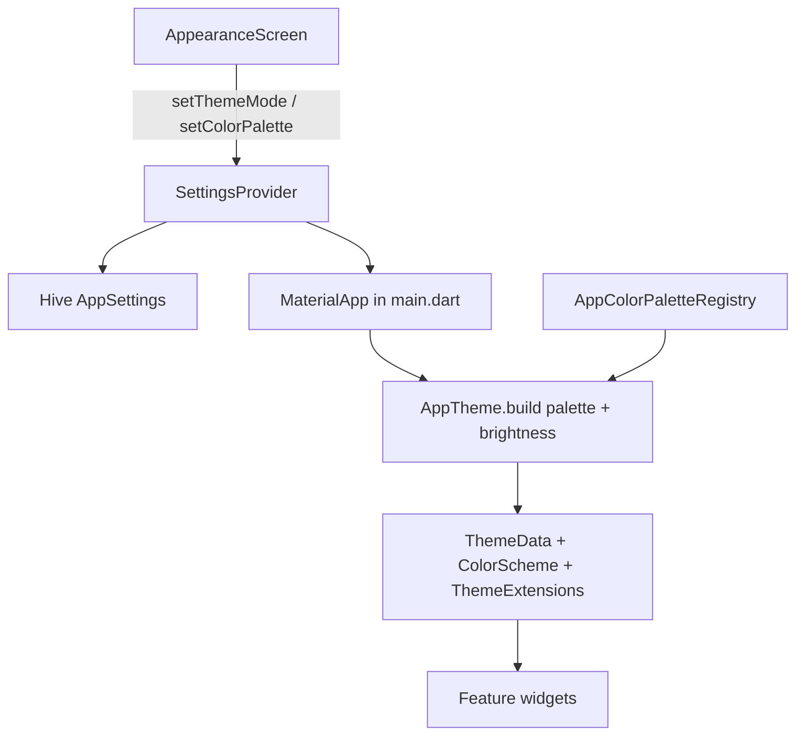

# Color Palettes & Theming

> **Last updated:** June 19, 2026  
> **Scope:** User-selectable color palettes, dynamic `ThemeData` construction, developer extension guidelines, and UI color usage rules.

---

## Overview

ديوان المال supports **two independent appearance dimensions**:

| Dimension | User control | Persistence | Effect |
|-----------|--------------|-------------|--------|
| **Brightness** | Light / Dark / System | `AppSettings.themeMode` (Hive) | Which `ThemeData` variant MaterialApp applies |
| **Color palette** | 5 built-in palettes | `AppSettings.colorPaletteKey` (Hive) | Scaffold, surfaces, accents, inputs, nav, charts, buttons |

Both are configured on **Settings → Appearance** (`/settings/appearance`).

A third independent dimension — **font size** (Default / Large / Extra Large) — is also on the same screen. See [font-size-preferences.md](./font-size-preferences.md).

The **Original** palette keeps the sky-blue light-mode identity and uses **neutral dark-grey** surfaces in dark mode (`#121212` scaffold, `#1E1E1E` cards) instead of the previous blue-navy cast.

---

## Architecture



### Data flow

1. `SettingsProvider` loads `AppSettings` from Hive on startup.
2. `main.dart` uses `context.select` for **`themeMode`** and **`colorPaletteId`** only (not the full provider — avoids auth redirect side effects).
3. `MaterialApp` receives:
   - `theme: AppTheme.build(palette: id, brightness: light)`
   - `darkTheme: AppTheme.build(palette: id, brightness: dark)`
   - `themeMode: settings.themeMode`
4. Widgets read colors from **`Theme.of(context)`** and **`context.appColors` / `context.palette`**.

---

## Token layers (read this before adding colors)

The design system uses **three layers**. Do not mix them incorrectly.

### 1. `AppColors` — fixed semantics only

**File:** `lib/core/constants/app_colors.dart`

| Use for | Examples |
|---------|----------|
| Financial meaning that must not change per palette | `success`, `expense`, `warning`, `debtAccent` |
| Static fallbacks in code **without** `BuildContext` | `TransactionIconStyles.forTransfer(primary: …)` default |

**Do not** use `AppColors.primary`, `primaryDeep`, `primaryLight`, or `primaryContainer` in new feature UI. Those values reflect the Original palette only and will not update when the user switches palettes.

Legacy surface tokens in `AppColors` (e.g. `backgroundDark`) remain for reference but **active theming** comes from palette definitions + `AppThemeColors`.

### 2. `AppThemeColors` — surfaces & typography colors

**File:** `lib/core/theme/app_theme_colors.dart`  
**Access:** `context.appColors` or `Theme.of(context).extension<AppThemeColors>()`

Per-palette, per-brightness tokens: scaffold, surfaces, text, inputs, dividers, nav bar, auth gradients, clay card shadows (`cardShadow`, `cardShadowSky`).

Static `AppThemeColors.light` / `.dark` are **fallbacks only** when no extension is attached.

### 3. `AppAccentColors` — brand / accent spectrum

**File:** `lib/core/theme/palettes/app_color_palette.dart`  
**Access:** `context.palette` or `Theme.of(context).extension<AppAccentColors>()`

| Field | Typical use |
|-------|-------------|
| `primary` | Buttons, selected nav, links, chart bars (non-expense) |
| `primaryDeep` | Pressed states, deep accents |
| `primaryLight` | Tinted chip / icon backgrounds |
| `primaryAccent` | Secondary highlights, dark-mode primary variant |
| `onPrimary` | Text/icons on filled primary buttons |

For most widgets, **`Theme.of(context).colorScheme.primary`** is sufficient — it is seeded from `accent.primary` in `AppTheme.build`.

---

## Built-in palettes

Registered in `AppColorPaletteRegistry.all` (`lib/core/theme/palettes/`).

| ID | Storage key | ARB name key | Preview stops (dark → light) |
|----|-------------|--------------|------------------------------|
| `original` | `original` | `paletteOriginal` | Sky blue + neutral grey dark |
| `deepSea` | `deep_sea` | `paletteDeepSea` | `0d1b2a … e0e1dd` |
| `gothicGlam` | `gothic_glam` | `paletteGothicGlam` | `000000 … f0eff4` (dark scaffold lifted to `#0A0A0A`) |
| `purpleHaze` | `purple_haze` | `palettePurpleHaze` | `0e273c … e8d7f1` |
| `turquoiseHarmony` | `turquoise_harmony` | `paletteTurquoiseHarmony` | `05668d … f0f3bd` |

Each palette file exports one `const` definition, e.g. `kDeepSeaPalette`, containing:

- `previewStops` — 5 colors for the appearance picker strip  
- `light` / `dark` — each an `AppPaletteScheme` with full `AppAccentColors` + `AppThemeColors`

**Original dark-mode surfaces (reference):**

| Token | Value |
|-------|-------|
| Scaffold | `#121212` |
| Surface / card | `#1E1E1E` |
| Elevated | `#2C2C2C` |
| Primary accent | `#38BDF8` (unchanged sky identity) |

Dark-mode clay shadows use **neutral black** only (`cardShadowSky` without blue tint) to avoid the previous “glow” effect.

---

## Key files

| File | Role |
|------|------|
| `lib/core/theme/palettes/app_color_palette.dart` | `AppColorPaletteId`, `AppColorPaletteDefinition`, `AppPaletteScheme`, `AppAccentColors` |
| `lib/core/theme/palettes/app_color_palette_registry.dart` | Central list + `find()` |
| `lib/core/theme/palettes/*_palette.dart` | One file per palette |
| `lib/core/theme/palettes/palette_contrast.dart` | WCAG helpers (`onColor`, `inputFill`, …) |
| `lib/core/theme/app_theme.dart` | `AppTheme.build(palette, brightness)` |
| `lib/core/extensions/context_theme.dart` | `context.appColors`, `context.palette` |
| `lib/models/app_settings.dart` | `colorPaletteKey` + Hive adapter (backward compatible) |
| `lib/providers/settings_provider.dart` | `colorPaletteId`, `setColorPalette()` |
| `lib/main.dart` | Wires palette + themeMode into `MaterialApp` |
| `lib/features/profile/appearance_screen.dart` | Theme mode + palette picker + amount format |

---

## Persistence & migration

**Hive field:** `AppSettings.colorPaletteKey` (`String?`)

- `null` or unknown key → defaults to **Original** via `AppColorPaletteId.fromStorageKey`.
- Adapter appends the field at the **end** of the serialized record; existing installs read without migration crashes.
- **Never change** existing `storageKey` strings after release — they are the on-disk contract.

```dart
await context.read<SettingsProvider>().setColorPalette(AppColorPaletteId.deepSea);
```

No app restart required; `MaterialApp` rebuilds from `context.select` on `colorPaletteId`.

---

## Developer guidelines

### Reading colors in widgets (required)

```dart
// Preferred — Material 3, reacts to palette
final primary = Theme.of(context).colorScheme.primary;

// Surfaces, text, inputs
final colors = context.appColors;

// Full accent spectrum when needed
final accent = context.palette;
accent.primaryLight.withValues(alpha: 0.12);
```

### What not to do

```dart
// BAD — ignores user palette
color: AppColors.primary

// BAD — const widget with runtime theme
const Icon(Icons.star, color: Theme.of(context).colorScheme.primary)

// BAD — hardcoded scaffold in features
backgroundColor: Color(0xFF0C1A2E)
```

Use theme tokens or pass `Color` from a parent that has `BuildContext`.

### Code without `BuildContext`

Static helpers (e.g. `TransactionIconStyles`, `treasuryIconSpecFor`) may keep **`AppColors.primary`** as a compile-time fallback, or accept an optional `Color? primary` parameter:

```dart
TransactionIconStyles.forTransfer(primary: Theme.of(context).colorScheme.primary);
TransactionIconStyles.amountColorForKind(kind, primary: primary);
```

### Charts

`AppBarChart` / `BarChartMapper` / `AppChartTheme.buildRod` take **`primary`** from `colorScheme.primary`. Expense/max bars still use **`AppColors.expense`** (fixed semantic).

### Localization

Every new palette requires **two ARB keys**:

- `palette<MyName>` — display name  
- Section label already exists: `settingsColorPalette`

Run after editing ARB files:

```bash
flutter gen-l10n
```

Wire the name in `AppearanceScreen._PalettePickerSection._nameFor` switch (or refactor to a map if the list grows).

---

## Adding a new palette (checklist)

1. **Enum** — Add value to `AppColorPaletteId` in `app_color_palette.dart` with a new **stable** `storageKey`.
2. **Definition** — Create `lib/core/theme/palettes/my_palette.dart`:
   - Define explicit `AppThemeColors` for light and dark (do not rely purely on algorithmic generation — fintech readability requires hand tuning).
   - Set `previewStops` (exactly 5 colors, ordered for the UI strip).
   - Verify `onPrimary` contrast on primary buttons.
3. **Registry** — Import and append to `AppColorPaletteRegistry.all`.
4. **Localization** — Add `paletteMyName` to `app_ar.arb` and `app_en.arb`; run `flutter gen-l10n`.
5. **Appearance UI** — Add case in `_nameFor` in `appearance_screen.dart`.
6. **QA** — Manual pass: light + dark + RTL for scaffold, cards, inputs, nav, auth, dashboard chart, appearance picker itself.
7. **Analyze** — `flutter analyze` (no new errors).

### Palette authoring notes

- Map your 5 brand stops to **roles** (scaffold, surface, accent, text) explicitly in the definition file.
- Use `PaletteContrast.onColor()` when choosing `onPrimary` if unsure.
- **Dark mode:** keep `cardShadowSky` neutral (black alpha) unless product explicitly wants tinted clay glow.
- **Gothic / near-black palettes:** lift scaffold slightly off `#000000` for OLED legibility (see Gothic Glam `#0A0A0A`).
- **Financial colors** stay in `AppColors` — never bake success/expense into palette files.

---

## User-facing behavior

**Appearance screen** (`/settings/appearance`):

1. **Theme mode** — Light / Dark / System (clay chip toggle).  
2. **Color palette** — List of cards with 5-stop gradient + localized name; checkmark on selection.  
3. **Amount format** — Western / European / Plain (see `docs/modules/number-formatting.md`).

Theme mode and palette are **orthogonal**: e.g. Deep Sea palette + System brightness is valid.

---

## QA checklist (per palette × brightness)

Use this when shipping a new palette or changing tokens.

- [ ] Scaffold and card surfaces readable; no unintended blue “glow” in dark mode  
- [ ] Body text ≥ WCAG AA contrast on surface (spot-check with contrast tool)  
- [ ] Primary buttons: `onPrimary` readable  
- [ ] Inputs: hint, border, focus ring visible  
- [ ] Bottom nav / navigation rail selected state uses palette primary  
- [ ] Dashboard expense chart: max bar still **red** (`AppColors.expense`); other bars use primary  
- [ ] PIN dots, auth screens, appearance picker itself  
- [ ] **RTL** Arabic layout  
- [ ] Palette persists after kill + relaunch  
- [ ] `flutter analyze` clean (no new errors)

---

## Known limitations & follow-ups

| Topic | Status |
|-------|--------|
| Credit card JPG backgrounds (`card-bg-light/dark.jpg`) | Palette-agnostic art; optional palette-tinted scrim on hero card is a future polish item |
| `AppColors` legacy primary/surface constants | Retained for static fallbacks; feature UI should use theme tokens |
| `AppTheme.light()` / `AppTheme.dark()` | Convenience wrappers defaulting to Original; prefer `AppTheme.build` in new code |
| Per-palette contrast automation | `PaletteContrast` helpers exist; final tokens are hand-defined per palette |

---

## Related documentation

| Topic | File |
|-------|------|
| Project status & changelog | `docs/project-progress.md` |
| Number format (same appearance screen) | `docs/modules/number-formatting.md` |
| Responsive + dark mode QA | `docs/responsive-architecture.md` |
| Cursor engineering rules | `.cursor/rules/` |

---

## Quick reference

```dart
// Build theme (main.dart)
AppTheme.build(palette: AppColorPaletteId.original, brightness: Brightness.light);

// Read in widget
Theme.of(context).colorScheme.primary
context.appColors.textPrimary
context.palette.primaryAccent

// Persist user choice
settings.setColorPalette(AppColorPaletteId.purpleHaze);
```
