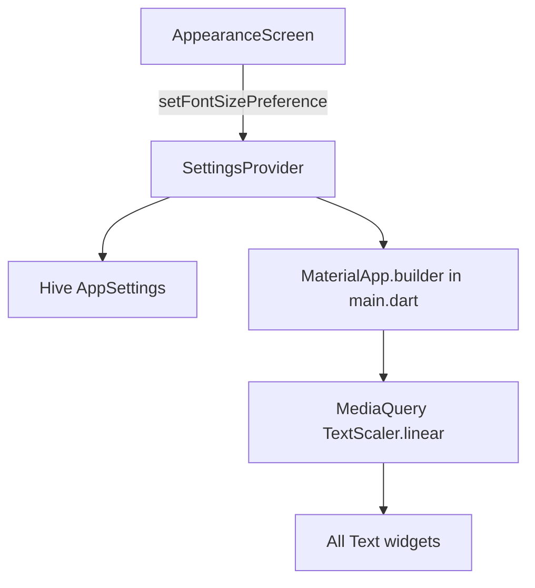

# Font Size Preferences

> **Last updated:** June 19, 2026  
> **Scope:** User-selectable font size presets, global `TextScaler` wiring, developer rules, and layout QA checklist.

---

## Overview

ديوان المال supports **three discrete font size presets** on **Settings → Appearance** (`/settings/appearance`):

| Preset | Hive index | Scale factor | Use case |
|--------|------------|--------------|----------|
| **Default** | 0 | 1.0 | Design baseline |
| **Large** | 1 | 1.15 | Moderate readability bump |
| **Extra Large** | 2 | 1.25 | Strong accessibility (capped to limit overflow) |

The app **replaces** the OS accessibility text scale with the selected preset — fintech layouts stay predictable across devices.

Font **families** (Qomra headings, Alyamama body) are unchanged; only size scales.

---

## Architecture



### Data flow

1. `FontSizePreference` enum (`lib/models/font_size_preference.dart`) defines presets and `scaleFactor`.
2. `AppSettings.fontSizePreference` persists via Hive (`fontSizePreferenceIndex`, backward-compatible adapter append).
3. `SettingsProvider.setFontSizePreference()` saves and notifies listeners.
4. `main.dart` uses `context.select` for **`fontSizePreference.scaleFactor`** only (not the full provider).
5. `MaterialApp.router(builder: …)` wraps the tree:

```dart
MediaQuery(
  data: MediaQuery.of(context).copyWith(
    textScaler: TextScaler.linear(scaleFactor),
  ),
  child: child!,
)
```

This scales **all** `Text` widgets uniformly — including hardcoded `fontSize`, `ThemeData.textTheme`, `AppTextStyles`, and chart axis labels.

---

## Single scale layer (critical)

**Do not add a second scale layer.**

- `AppTypography` tokens use **raw design sizes** (40, 24, 14…).
- The user preset applies **once** via `MediaQuery` / `TextScaler`.
- Removed: `AppTypography.textScaleFactor`, `AppTypography.scaled()`, and redundant `fontSize` overrides in `AppTextStyles`.

---

## Developer guidelines

1. **Never** set `AppTypography.textScaleFactor` or multiply font sizes by a custom scale helper in widgets.
2. Prefer [`AppTextStyles`](../../lib/core/theme/app_text_styles.dart) tokens for new text; hardcoded `fontSize` still scales via `TextScaler`.
3. For dense fixed-height UI at Extra Large, use:
   - `FittedBox(fit: BoxFit.scaleDown, …)` for large amounts / PIN digits
   - `maxLines` + `TextOverflow.ellipsis` for labels
   - `MediaQuery.textScalerOf(context).scale(base)` for chart `reservedSize` and similar layout spacing
4. **Icons** (`Icon(size: N)`) are **not** affected by `TextScaler` — touch targets stay stable (correct for fintech).
5. **Do not** multiply OS `TextScaler` — the app replaces it entirely.

---

## Layout QA checklist (Extra Large @ 1.25×)

Test with Arabic RTL, light and dark themes:

| Area | File | Mitigation |
|------|------|------------|
| Balance hero card | `dashboard_balance_hero_card.dart` | `FittedBox` on amount |
| Transaction amount entry | `transaction_add_screen.dart` | `FittedBox` on amount display |
| PIN keypad digits | `pin_keypad.dart` | `FittedBox` in grid cells |
| Chart axis labels | `app_chart_theme.dart` | `textScaler.scale(64)` / `scale(36)` for `reservedSize` |
| Appearance preview | `appearance_screen.dart` | Live preview card |

---

## Related appearance dimensions

Font size is independent of:

- **Theme mode** (light / dark / system) — see [color-palettes-and-theming.md](./color-palettes-and-theming.md)
- **Color palette** (5 built-in palettes)
- **Amount format** (Western / European / Plain)

All four are configured on `/settings/appearance`.

---

## Files

| File | Role |
|------|------|
| `lib/models/font_size_preference.dart` | Enum + scale factors |
| `lib/models/app_settings.dart` | Hive persistence |
| `lib/providers/settings_provider.dart` | Getter + setter |
| `lib/main.dart` | `MaterialApp.builder` + `TextScaler` |
| `lib/core/theme/app_typography.dart` | Raw size tokens (no internal scale) |
| `lib/features/profile/appearance_screen.dart` | 3-preset UI + preview |
